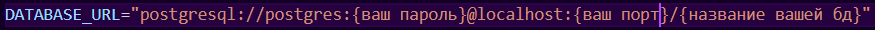

# Mockup backend

Сделал эту штуку по-большей части для пет-проектов, где хочется выводить какие-то данные, получать какие-то данные и тд и тп.

Кратко опишу что за что отвечает:

1. Файл prisma/schema.prisma отвечает за структуру вашей бд. По умолчанию есть user, todo, product и post
2. Файл prisma/seed.ts отвечает за стартовое наполнение вашей бд. По умолчанию 4 юзера и 5 тудушек
3. Файл .env, который вам нужно создать вручную. Там указывается
   
4. Файл index.ts, где происходит вся магия, а именно:
   1. Базовое подключение и запуск express;
   2. Маршрут /health, который показывает состояние вашего сервера;
   3. Маршрут /getTodos, который возвращает вам тудушки.

5. Файл package.json, а именно секция со скриптами. Там только 1 скрипт для запуска сервера - dev(npm run dev)

## Порядок установки

1. Скачиваем postgresql вот отсюда https://www.postgresql.org/download/
2. Устанавливаем на свой ПК(ВАЖНО! Обязательно запомните пароль и порт, который вы указывали при установке)
3. Скачиваем node.js, хотя я уверен, что он у всех есть
4. Клонируем репозиторий к себе
5. Создаем файлик .env, куда пишем данные сверху
6. Делаем `npm install`(если будут ошибки в консоли, то `npm install --force`)
7. Выполняем

```
npx prisma
```

8. Выполняем

```
   npx prisma migrate dev
```

9. Выполняем

```
npx prisma generate
```

10. Выполняем

```
npx prisma db seed
```

Если после строки ✅ Data created не вернулось управление, нажмите Ctrl + C

11. Запустите сервер

```
npm run dev
```

12. Перейдите на нужный localhost(можно сделать прямо из консоли, если зажать Ctrl и навести мышку на http://localhost...)
13. Перейдите по адресу localhost:{ваш порт}/health и localhost:{ваш порт}/getTodos, если данные отобразились, то вы большой молодец
